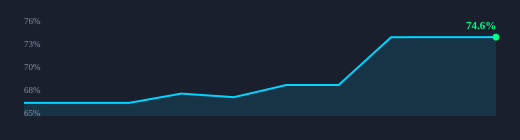

# Serpent Circle Hype-Coin Predictive Engine

[](https://github.com/kingcinder/Hype-Coin-Predictive-Engine/actions/workflows/ci.yml)
[](https://codecov.io/gh/kingcinder/Hype-Coin-Predictive-Engine)
[](https://github.com/pre-commit/pre-commit)

Test coverage trajectory (backend core, weekly):



Local-first research intelligence for speculative Solana, Base, and Ethereum tokens. It separates hype from structural danger and stores point-in-time evidence so scans can be replayed without future leakage.

This is not an auto-trader, wallet, custody system, or guaranteed-profit bot.

## One-command startup

```bash
python -m engine
```

This one process bootstraps the SQLite database (idempotent), then runs the ingestion worker loop, the REST API on http://localhost:8000, and the Streamlit GUI on http://localhost:8501 together. Ctrl+C stops the worker, API, and GUI cleanly.

Equivalent Makefile target: `make engine`.

## Architecture Overview

```
┌─────────────────────────────────────────────────────────────────┐
│                    Streamlit GUI (port 8501)                    │
│  Command Center · Engine Control · Data Lake · Night Crawlers   │
│  Confidence Dashboard · Webhooks · Forecast · Risk · Radar      │
└──────────────────────────┬──────────────────────────────────────┘
                           │ HTTP (api_get / api_post)
┌──────────────────────────▼──────────────────────────────────────┐
│                     FastAPI REST API (port 8000)                 │
│  /health · /tokens/* · /scores/* · /forecasts · /lifecycle/*   │
│  /engine/* · /nightcrawlers/* · /data/* · /webhooks/*           │
└──────────────────────────┬──────────────────────────────────────┘
                           │ SessionLocal
┌──────────────────────────▼──────────────────────────────────────┐
│                    Engine Worker Loop (main thread)              │
│  ┌──────────┐  ┌──────────┐  ┌──────────┐  ┌────────────────┐ │
│  │ Ingestion│→ │ Forecast │→ │Retention │→ │ Night Crawlers │ │
│  │  Scanner │  │ Training │  │+ Archive │  │   Pipeline     │ │
│  └──────────┘  └──────────┘  └──────────┘  └───────┬────────┘ │
│                                                      │          │
│  ┌──────────────────────────────────────────────────▼────────┐ │
│  │              Data Lake Manager (per scan)                  │ │
│  │  Signal Scoring → Label Densification → Webhook Dispatch  │ │
│  └───────────────────────────────────────────────────────────┘ │
└─────────────────────────────────────────────────────────────────┘
                           │
┌──────────────────────────▼──────────────────────────────────────┐
│                         SQLite + Parquet Lake                    │
│  serpent.db (hot) · data/archive/* (cold Parquet)               │
└─────────────────────────────────────────────────────────────────┘
```

## Night Crawlers — Army of Data Spiders

Seven crawlers continuously feed the engine with expanding data:

| Crawler | Source | Data Collected |
|---------|--------|---------------|
| **CoinGecko** | coingecko.com | Trending coins, new listings, market data |
| **Pump.fun** | pump.fun | New token launches, bonding curve progress |
| **DeFiLlama** | defillama.com | TVL, protocol data, new pools |
| **Whale Tracker** | Etherscan/Solana RPC | Large wallet movements, smart money flows |
| **Explorer** | Etherscan/Solana FM | On-chain metrics, contract deployments |
| **Nitter** | nitter.net | Social sentiment (Twitter proxy) |
| **Presale** | PinkSale/CryptoRank | Upcoming token launches |

### Self-Adjusting Heuristics

The heuristics engine learns which sources provide the most actionable signals:

- **Source Reliability** — tracks actionability rate per source, adjusts crawl frequency
- **Pattern Memory** — remembers which patterns correlate with successful hype coins
- **Adaptive Frequency** — reliable sources are crawled more often; noisy ones are throttled
- **Automatic Pruning** — sources with <5% actionability over 7 days are deprioritized

### Night Crawler Pipeline

```
Engine Loop (every scan)
    ↓
Interval Gate (every nightcrawler_interval_minutes, default 30m)
    ↓
Orchestrator runs 7 crawlers independently
    ├── Each crawler has its own try/except (one crash doesn't abort the fleet)
    ├── Thread-safe singleton with threading.Lock
    └── Adaptive frequency per source
    ↓
Pipeline: Score → Archive → Alert
    ├── Signal scoring (novelty, corroboration, magnitude)
    ├── Raw evidence storage → Data Lake
    ├── High-signal webhook dispatch
    └── Heuristics update (learn what works)
```

## Data Lake Management

The data lake management layer sieves actionable data from noise:

### Signal Scoring

Every data point is scored across 4 dimensions:
- **Novelty** — is this information new to the system?
- **Corroboration** — does multiple sources confirm it?
- **Temporal Relevance** — how fresh is it?
- **Magnitude** — how significant is the change?

Items with signal score ≥0.4 are "actionable"; everything else is noise.

### Label Densification

Accelerates forecast training by interpolating prices between sparse market snapshots at hourly intervals. Increases label count from ~4 to 30+ quickly, enabling ML model training.

### Webhook Notifications

Register HTTP endpoints to receive real-time alerts:
- Custom HTTP POST endpoints
- Telegram bot support
- Discord webhook support
- HMAC-SHA256 signature verification
- Per-webhook cooldowns and event filtering
- Dispatch history tracking

## API Endpoints

### Core
- `GET /health` — API health status
- `GET /tokens/hot` — Top hype tokens
- `GET /scores/top` — Top research candidates
- `GET /tokens/{id}` — Token detail with features and explanation
- `GET /tokens/{id}/similar` — Historical similar setups
- `GET /alerts` — Recent alerts
- `POST /alerts/{id}/ack` — ACK an alert (suppresses repeat pushes; optional `useful`/`noise` rating)
- `GET /alerts/quality` — Signal-quality ledger of operator ACK feedback

### Engine Control
- `GET /engine/status` — Live engine runtime status
- `POST /engine/scan` — Trigger manual ingestion scan
- `POST /engine/forecast` — Trigger forecast model training
- `POST /engine/retention` — Trigger retention autopilot
- `POST /engine/seed` — Seed fixture data
- `GET /engine/stream` — SSE stream for real-time phase updates

### Night Crawlers
- `GET /nightcrawlers/status` — Crawler fleet status
- `GET /nightcrawlers/heuristics` — Heuristics engine state
- `POST /engine/nightcrawlers` — Trigger Night Crawler pass

### Data Lake
- `GET /data/labels/progress` — Label generation progress
- `POST /data/signal/score` — Score recent signals
- `POST /data/densify-labels` — Trigger label densification
- `GET /data/confidence` — Confidence dashboard data

### Webhooks
- `GET /webhooks` — List registered webhooks
- `POST /webhooks/register` — Register new webhook
- `POST /webhooks/{id}/delete` — Delete webhook
- `GET /webhooks/dispatches` — Dispatch history

### Radar & Intelligence
- `GET /radar/ignitions` — Ignition events
- `GET /radar/prelaunch` — Prelaunch candidates
- `GET /fingerprint/top` — Syndicate fingerprints
- `GET /forecasts` — Forecast predictions
- `GET /narrative/clusters` — Narrative clusters
- `GET /catalysts` — Catalyst timetable
- `GET /lifecycle/current` — Current lifecycle phases
- `GET /lifecycle/events` — Lifecycle transitions
- `GET /lifecycle/alerts` — Terminal transition alerts

### Infrastructure
- `GET /rpc/pool` — RPC pool health status
- `GET /features/velocity` — Narrative velocity features
- `GET /archive/manifests` — Archive manifests
- `GET /retention/runs` — Retention history
- `GET /retention/growth` — Lake-growth trendline + projected disk-full horizon
- `GET /backtest/results` — Backtest results
- `GET /parity/latest` — Latest lake-vs-SQL parity run (mismatch count, decision window, state)
- `GET /parity/mismatches` — Reviewable lake-vs-SQL divergence history (per-asset/feature filters)
- `GET /ops/console` — Live ops console

## GUI Views

| View | Description |
|------|-------------|
| **Command Center** | Compact live overview with auto-refresh |
| **Engine Control** | Status, trigger actions, seed data |
| **Night Crawlers** | Crawler fleet status, heuristics, trigger |
| **Data Lake** | Signal scoring, label progress, archive stats |
| **Confidence Dashboard** | Scoring breakdown, feature importance |
| **Webhook Manager** | Register, list, delete webhooks |
| **Top Hype Tokens** | Tokens ranked by hype score |
| **Top Research Candidates** | Tokens ranked by research priority |
| **Risk Console** | Risk assessment with band coloring |
| **Forecast** | ML predictions with feature contributions |
| **Lifecycle Radar** | Token lifecycle phases and transitions |
| **Ignition Radar** | First liquidity injections and sniper bursts |
| **Narrative Radar** | Mention clusters and dev activity |
| **Feed Health** | RPC pool status and component health |
| **Backtest & Drift** | Historical backtest results |

## Installation

One command installs Serpent Circle as a system service:

```bash
git clone https://github.com/kingcinder/Hype-Coin-Predictive-Engine.git
cd Hype-Coin-Predictive-Engine-main
sudo bash packaging/install.sh
```

After install, manage with:

```bash
sudo serpent start       # start the engine
sudo serpent stop        # stop it
sudo serpent restart     # restart it
sudo serpent status      # check if it's running
sudo serpent logs        # watch live logs
sudo serpent update      # pull latest + restart
sudo serpent uninstall   # remove (keeps data)
```

Open **http://localhost:8501** for the GUI, **http://localhost:8000/health** for the API.

See **[INSTALL.md](INSTALL.md)** for full instructions, configuration, troubleshooting, and the uninstaller.

## Development

```bash
# Install dev dependencies (pinned dev lock included)
python -m pip install -e ".[dev]"

# Run engine (all-in-one)
python -m engine

# Run tests
python -m pytest tests/ -x -q

# Run tests with coverage (backend core only; ui/tests/scripts excluded)
python -m pytest tests/ -q --cov=. --cov-report=term-missing

# Lint + typecheck
ruff check .
mypy api/ common/ engine/ crawlers/ data_lake/ ui/

# Format
ruff format .

# Pre-commit hooks (ruff format + lint on every commit)
pre-commit install

# Refresh the coverage trend chart + history (committed to coverage/)
python -m pytest tests/ -q --cov=. --cov-report=xml
python scripts/coverage_history.py
```

## Configuration

Key environment variables (set in `.env`):

| Variable | Default | Description |
|----------|---------|-------------|
| `SCAN_INTERVAL_SECONDS` | 300 | Time between scan iterations |
| `NIGHTCRAWLER_ENABLED` | True | Enable Night Crawler pipeline |
| `NIGHTCRAWLER_INTERVAL_MINUTES` | 30 | Minutes between crawler runs |
| `DATA_LAKE_ENABLED` | True | Enable Data Lake management |
| `WEBHOOK_ENABLED` | True | Enable webhook dispatch |
| `FORECAST_TRAIN_FREQUENCY_HOURS` | 24 | Hours between forecast retraining |
| `UI_REFRESH_SECONDS` | 30 | GUI auto-refresh interval |

## License

MIT
